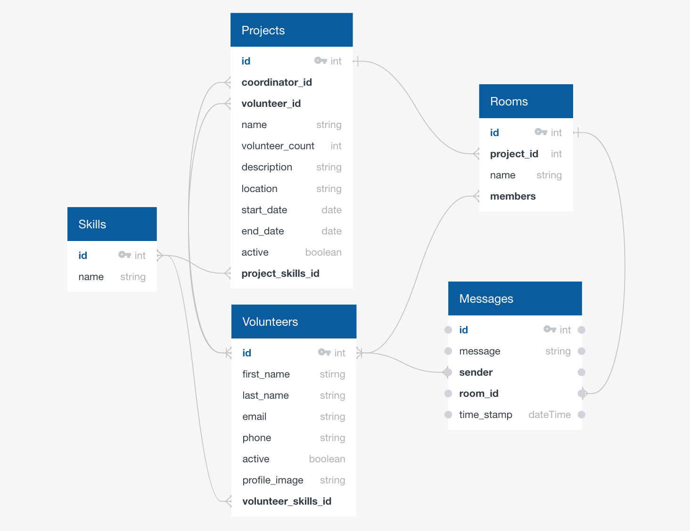
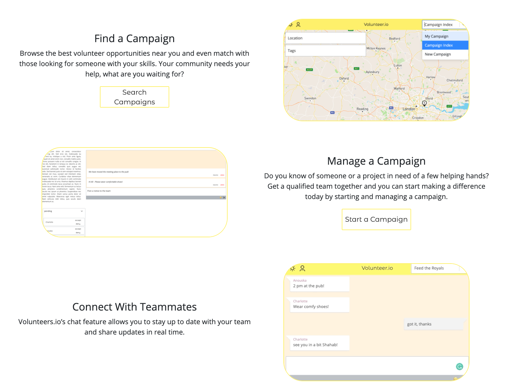

# SEI50 Project - ***Volunteer***

## Application Outline
***Volunteer*** is an application designed to coordinate volunteer projects (campaigns). The program allows users to find and sign-up for campaigns in their area that are in need of volunteer help. In addition, users can create campaigns, and manage both the onboarding and coordination of volunteers throughout the project. User profiles include any optional skills they may have, as well as the shifts they are available to volunteer. Campaign owners can match volunteers based on these attributes when confirming or rejecting pending applicants. In addition, each campaign has chat rooms to make coordination easier. The campaign owner and coordinators have thier own chat in addition to a project wide chat for all members. An interactive map aids in searching for possible campaigns as well as locating those a user is signed up for.

## Project Brief
Work either individually or remotely in a group to create a full-stack web application using a Django Rest Framework to serve data from a PostgreSQL database to a React front end. The application must demonstrate the use of multiple relationships and CRUD functionality for the intended models. Plan and create an ERD prior to moving on to development.


## Technologies Used

### Front End
* JavaScript
* React
* Bootstrap
* Axios
* MapBox-GL / Geocoder
* Emoji Mart
* Cloudinary

### Back End
* Django / Django Rest Framework
* PyJWT
* PostgreSQL
* Channels / Channels-Redis
* Redis

### Collaboration
* Git + Github
* Slack
* Trello

## Process

Having enjoyed collaborating remotely on a previous project, I worked with a teammate on ***Volunteer***. The initial day was spent brainstorming ideas and specific user stories for a volunteer management application. The basic functions were deceivingly straightforward:

* Users can create volunteer campaigns/projects
* Campaigns would include a location, start date and description
* Users can search and sign-up for volunteer campaigns
* Campaign admins/owners can manage volunteer confirmation/rejection

In addition, we wanted to incorporate a live group chat into the volunteer projects to improve coordination. We decided this would be the first 'extra' feature we would add once the stories listed above were sufficiently mapped. This meant spending a day early in the project reading documentation on the handling of WebSocket requests and deciding what tools we would use to broker our messages. We then spent time experimenting to see if the idea was feasible within our timeframe. Once we had successfully created a chat room using Channels and Redis, we updated our ERD and wireframes.

<div align='center'>
  
</div>

We separated into roles with my teammate working on the front end and myself on the back end. Our application consisted of several relationships between users, volunteer campaigns, chat messages, chat rooms as well as skills to apply to both campaigns and users. The decision for which models would 'host' the relationships was based on how the user would likely interact with the models. This evolved as the application developed and would ultimately lead to many areas that I consider opportunities for refactoring in the next version of the app.

```python
class Campaign(models.Model):
    name = models.CharField(max_length=50)
    volunteer_count = models.IntegerField()
    description = models.TextField(max_length=800)
    latitude = models.CharField(max_length=20)
    longitude = models.CharField(max_length=20)
    start_date = models.DateTimeField()
    active = models.BooleanField(default=True)
    owner = models.ForeignKey(
        'jwt_auth.User',
        related_name='owned_campaigns',
        on_delete=models.CASCADE
    )
    coordinators = models.ManyToManyField(
        'jwt_auth.User',
        related_name='coord_campaigns',
        blank=True
    )
    pend_volunteers = models.ManyToManyField(
        'jwt_auth.User',
        related_name='pend_campaigns',
        blank=True
    )
    conf_volunteers = models.ManyToManyField(
        'jwt_auth.User',
        related_name='conf_campaigns',
        blank=True
    )

    def __str__(self):
        return f'{self.name} - Active: {self.active}'
```

The back end relies heavily on serializers to populate response bodies often consisting of several related models. This is especially the case for returning campaign details to the front end. A campaign owner needs the ability to adjust a volunteer's status from pending to confirmed (or removed) and manage the skills associated with the campaign. To account for these features, we needed to ensure the response for the initial campaign detail request included the necessary fields to form the subsequent requests a coordinator may make. Additionally, we needed to account for the chat rooms and their related messages.

```python
class PopulatedCampaignSerializer(CampaignSerializer):

    owner = NestedUserSerializer()
    pend_volunteers = NestedUserSerializer(many=True)
    conf_volunteers = NestedUserSerializer(many=True)
    campaign_skills = NestedSkillSerializer(many=True)
    message_rooms = RoomSerializer(many=True)
    coordinators = NestedUserSerializer(many=True)
    campaign_notices = NestedNoticeSerializer(many=True)
```

Once we had the user stories and chat functioning properly between the front end and the database, we worked together to complete styling and layout on the remaining front end components. Remaining time was used to add extra features including 2 additional models for a campaign notice board as well as shifts that can be matched between users and campaigns (similar to skills). The final steps included error handling related to forms and authorization.

<div align='center'>
  
</div>

## Future Version Considerations
My teammate and I have decided to work on a second version of this application without the time constraint. Our goals for the back end are to re-examine the models and views looking for opportunities to better utilize Django's capabilities, particularly our current use of and interaction with the ‘ManyToMany’ fields. On the front end, we would like to incorporate Hooks and a few other aspects that will make state and props management cleaner.